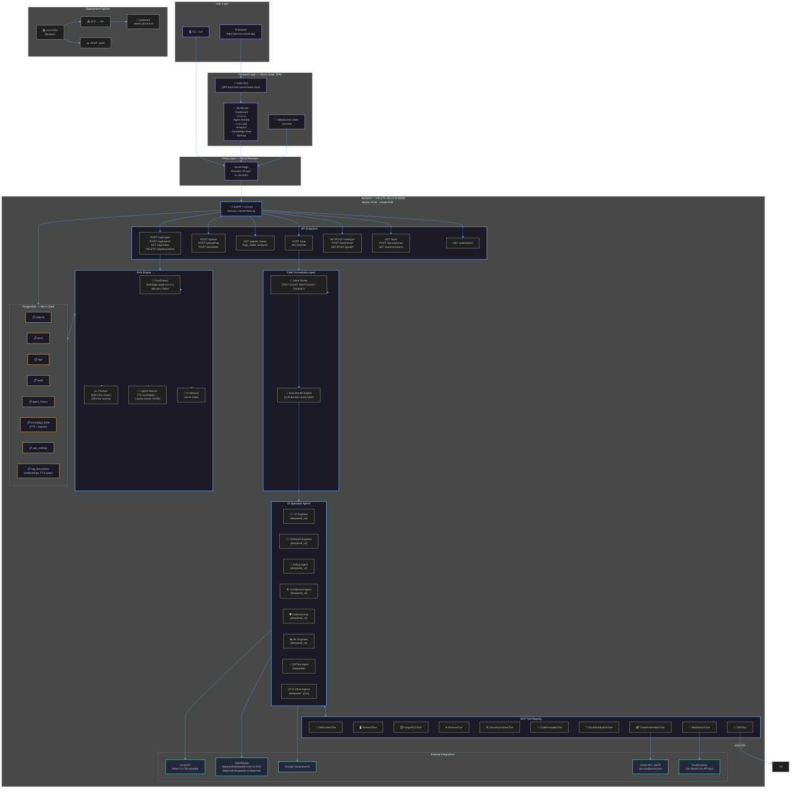

```mermaid
%%{init: {"flowchart": {"htmlLabels": true, "curve": "basis"}, "theme": "dark", "themeVariables": {"primaryColor": "#1a1b26", "primaryTextColor": "#a9b1d6", "primaryBorderColor": "#565f89", "lineColor": "#7aa2f7", "tertiaryColor": "#24283b", "fontSize": "12px"}}}%%
flowchart TB
    subgraph User["User Layer"]
        Browser["🌐 Browser\nhttps://jaxvora.vercel.app"]
        CLI["💻 CLI / curl"]
    end

    subgraph Frontend["Frontend Layer — Vercel (Static SPA)"]
        HTML["📄 index.html\n(SPA built from server/index.html)"]
        JS["⚡ JavaScript\n- Dashboard\n- Chat UI\n- Agent Monitor\n- Live Logs\n- Analytics\n- Knowledge Base\n- Settings"]
        WS_FE["🔌 WebSocket Client\n/ws/chat"]
    end

    subgraph ProxyLayer["Proxy Layer — Vercel Rewrites"]
        direction LR
        VERCEL["Vercel Edge\nRewrites all /api/*\nto VM:8090"]
    end

    subgraph Backend["Backend — VM (172.105.41.51:8090)\nUbuntu 24.04 · Linode 4GB"]
        direction TB
        FASTAPI["⚡ FastAPI + Uvicorn\nmain.py / server/main.py"]

        subgraph API["API Endpoints"]
            ChatAPI["POST /chat\nWS /ws/chat"]
            Upload["POST /upload\nPOST /upload/rag\nPOST /download"]
            Data["GET /agents, /tasks,\n/logs, /audit, /analytics"]
            RAG["POST /rag/ingest\nPOST /rag/search\nGET /rag/status\nDELETE /rag/documents"]
            Settings["GET/POST /settings/*\nPOST /send-email\nGET/POST /gmail/*"]
            Tools["GET /tools\nPOST /security/scan\nGET /memory/search"]
            WebSearch["GET /web/search"]
        end

        subgraph ChiefOrchestrator["Chief Orchestrator Agent"]
            direction LR
            Router["🧠 Intent Router\n(PDF? Gmail? SSH? Doctor? General?)"]
            Decider["🤖 Auto-Decide Engine\n(LLM decides action plan)"]
        end

        subgraph Agents["22 Specialist Agents"]
            AI_Eng["👨‍💻 AI Engineer\n(deepseek_v4)"]
            SW_Eng["👩‍💻 Software Engineer\n(deepseek_v4)"]
            Debug["🐛 Debug Agent\n(deepseek_v4)"]
            Arch["🏗️ Architecture Agent\n(deepseek_v4)"]
            Cyber["🛡️ Cybersecurity\n(deepseek_v4)"]
            ML["📊 ML Engineer\n(deepseek_v4)"]
            QA["✅ QA/Test Agent\n(deepseek)"]
            Others["📋 15 Other Agents\n(deepseek / groq)"]
        end

        subgraph ToolRegistry["MCP Tool Registry"]
            FileTool["📁 FileSystemTool"]
            TermTool["🖥️ TerminalTool"]
            DBTool["🗄️ PostgreSQLTool"]
            BrowserTool["🌐 BrowserTool"]
            SecTool["🔍 SecurityScannerTool"]
            CodeTool["✨ CodeFormatterTool"]
            EmailTool["📧 EmailNotificationTool"]
            GmailTool["📬 GmailAutomationTool"]
            SSHTool["🔐 SSHTool"]
            WebSearchTool["🔎 WebSearchTool"]
        end

        subgraph RAGEngine["RAG Engine"]
            Embedder["🧬 FastEmbed\nBAAI/bge-small-en-v1.5\n384-dim ONNX"]
            Chunker["✂️ Chunker\n1000-char chunks\n200-char overlap"]
            HybridSearch["🔀 Hybrid Search\nFTS candidates →\nCosine rerank (70/30)"]
            InMemoryIndex["💾 In-Memory\nVector Index"]
        end

        subgraph Integrations["External Integrations"]
            Groq["Groq API\nllama-3.3-70b-versatile"]
            OpenRouter["OpenRouter\ndeepseek/deepseek-chat-v3-0324\ndeepseek/deepseek-v4-flash:free"]
            GoogleAI["Google Generative AI"]
            GmailAPI["Gmail API / SMTP\njaxvora@gmail.com"]
            DDG["DuckDuckGo\nLite Search (no API key)"]
        end

        subgraph DB["PostgreSQL — Neon Cloud"]
            Projects["📋 projects"]
            Tasks["📋 tasks"]
            Logs["📋 logs"]
            Audit["📋 audit"]
            AgentHistory["📋 agent_history"]
            KnowledgeBase["📋 knowledge_base\n(FTS + trigram)"]
            AppSettings["📋 app_settings"]
            RagDocuments["📋 rag_documents\n(embeddings, FTS index)"]
        end
    end

    subgraph Deploy["Deployment Pipeline"]
        Local["💻 Local Dev\nWindows"]
        SCP["📤 SCP → VM"]
        Restart["🔄 systemctl\nrestart jaxvora-ai"]
        VercelCLI["▲ vercel --prod"]
    end

    %% Connections
    Browser --> HTML
    CLI --> VERCEL
    HTML --> JS
    JS --> VERCEL
    WS_FE --> VERCEL

    VERCEL --> FASTAPI

    FASTAPI --> ChatAPI
    FASTAPI --> Upload
    FASTAPI --> Data
    FASTAPI --> RAG
    FASTAPI --> Settings
    FASTAPI --> Tools
    FASTAPI --> WebSearch

    ChatAPI --> ChiefOrchestrator
    ChiefOrchestrator --> Router
    Router --> Decider
    Decider --> Agents

    Agents <--> ToolRegistry
    Agents --> Groq
    Agents --> OpenRouter
    Agents --> GoogleAI

    WebSearchTool --> DDG
    GmailTool --> GmailAPI
    SSHTool -->|"asyncssh"| VM

    RAG --> RAGEngine
    RAGEngine --> Embedder
    RAGEngine --> Chunker
    RAGEngine --> HybridSearch
    RAGEngine --> InMemoryIndex

    FASTAPI --> DB
    RAGEngine <--> DB

    %% Deploy flow
    Local --> SCP --> Restart
    Local --> VercelCLI

    %% Style
    classDef vm fill:#1a1b26,stroke:#7aa2f7,stroke-width:2px
    classDef external fill:#24283b,stroke:#73daca,stroke-width:1.5px
    classDef db fill:#1a1b26,stroke:#e0af68,stroke-width:1.5px
    classDef frontend fill:#1a1b26,stroke:#bb9af7,stroke-width:1.5px
    class FASTAPI,ChiefOrchestrator,Agents,ToolRegistry,RAGEngine,API vm
    class Groq,OpenRouter,GoogleAI,GmailAPI,DDG external
    class Projects,Tasks,Logs,Audit,AgentHistory,KnowledgeBase,AppSettings,RagDocuments db
    class Browser,CLI,HTML,JS,WS_FE,VERCEL frontend
```
